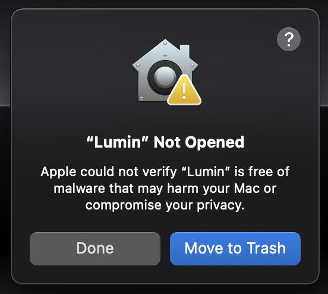
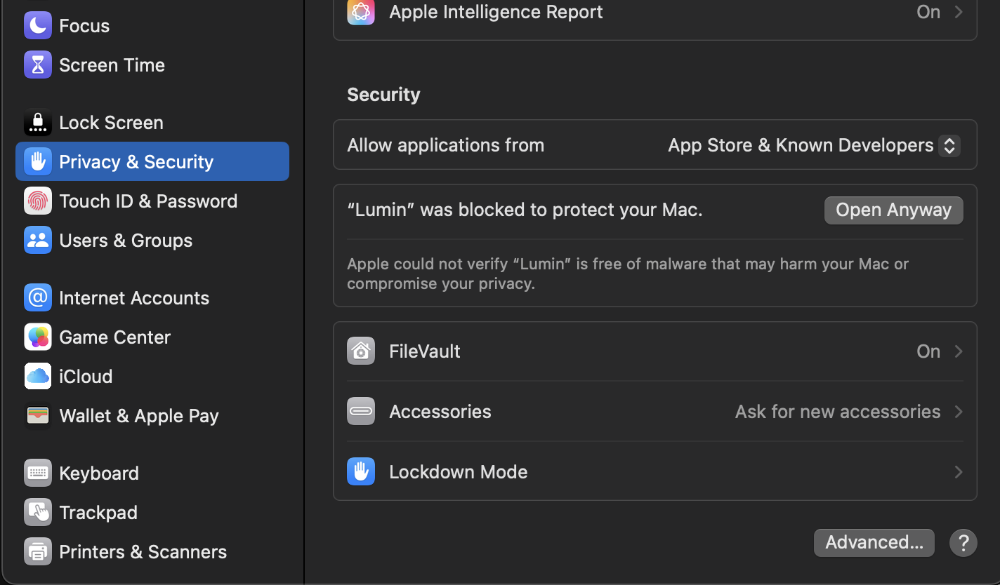
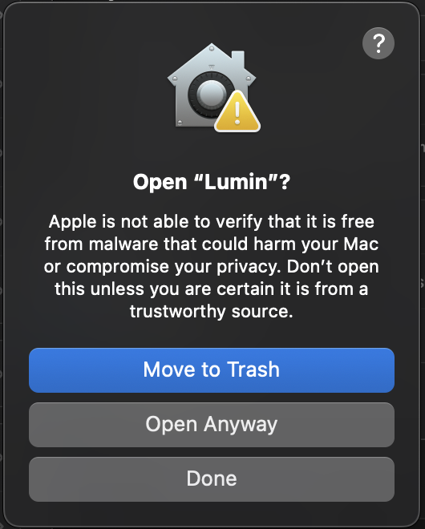
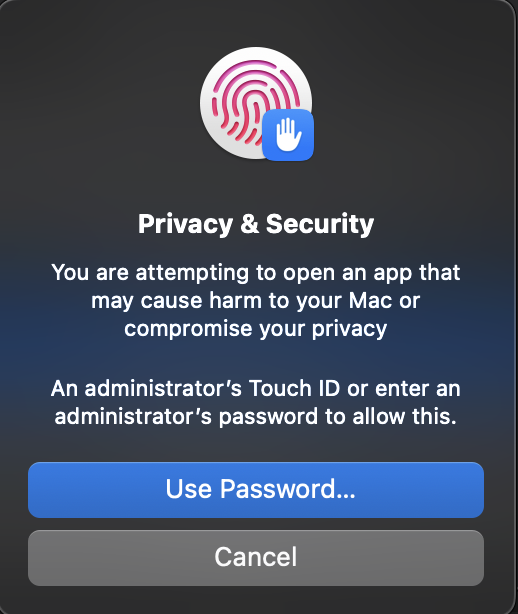

# Installing Lumin on macOS

The latest `Lumin.dmg` is always published on the project’s [GitHub Releases](https://github.com/0x1labs/lumin/releases) page. Because Lumin is currently distributed without an Apple Developer ID signature, macOS Gatekeeper will warn you the first time you open it. The steps below walk through installation and the one-time approval process.
> Note: The developer id costs 99$ per year. 

## 1. Download and install
1. Download the newest DMG from the assets section of [Releases](https://github.com/0x1labs/lumin/releases) page.
2. Double-click the DMG to mount it.
3. Drag **Lumin.app** into **Applications**.

## 2. Launch application
When you open Lumin for the first time, macOS will block it with the message “*Apple could not verify Lumin is free of malware...*” 

Just click Done in this popup.

## 3. Allow access
1. Go to **System Settings → Privacy & Security**. Near the bottom you’ll see a message about Lumin with an **Open Anyway** button – click it.

2. Then, the folloing popup should load. Click on `Open Anyway`

3. If macOS requests your administrator password, enter it to allow the launch.

   

The app now opens normally. You’ll only need to repeat this process if you download a brand-new unsigned build.

## 3. Updating later
Whenever a new DMG is released:
1. Quit Lumin if it’s running.
2. Download the latest DMG from Releases and replace `Lumin.app` in Applications.
3. Launch the new build. (Gatekeeper may ask you to repeat the **Open Anyway → Open** steps once per version.)
